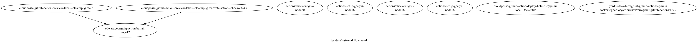

# gh-actions-dependency-graph
This `gh` extensions is designed to be used as a way to document what your workflows use where possible, as well as some security scanning tooling to look for potential vulnerabilities that could cause you issues.

## Required permissions
* Read contents - This application needs to be able to read the contents of repositories (which may include private repos) to pull down the actions defined in them to generate an accurate graph, and properly scan them.

## Usage Information
### Graph Dependencies
The `graph-deps` subcommand is used to scan your dependencies and generate a [GraphViz](https://graphviz.org/) file to represent the relationships between dependencies within a workflow.

```shell
# Output graph to the default file name of `deps.graphviz`
gh actions-dependency-graph graph-deps testdata/test-workflow.yaml
# Outputs graph to a different file name
gh actions-dependency-graph graph-deps testdata/test-workflow.yaml -o test-workflow.graphviz
```



### List Dependencies
Like the `graph-deps` subcommand, it generates a dependency representation with an additional indentation for each depth of dependent actions.
```shell
gh actions-dependency-graph list-deps testdata/test-workflow.yaml
```

### Scan
The scan subcommand is used to scan for various potential issues within workflows.  Below is a breakdown of issues and how to address them:
1. Node Version EOL - Node 16 was marked as EOL in September 2023, so any actions run via Node.js should be upgraded to run on `node20`.
2. Repo Jacking - Checks if the action is in a repository that is susceptible to [repo](https://blog.aquasec.com/github-dataset-research-reveals-millions-potentially-vulnerable-to-repojacking) [jacking](https://www.paloaltonetworks.com/blog/prisma-cloud/github-actions-worm-dependencies/).  If it is, some contextual information will be provided for how to update it to fix this vulnerability.

```shell
# Scan and output in plain text the results of the scan
gh actions-dependency-graph scan testdata/test-workflow.yaml

# Scan and output in json the results of the scan
gh actions-dependency-graph scan testdata/test-workflow.yaml -o json
```
